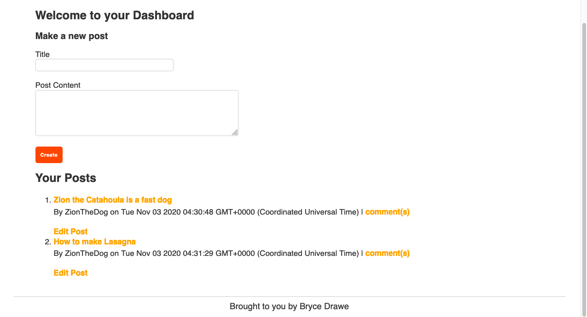
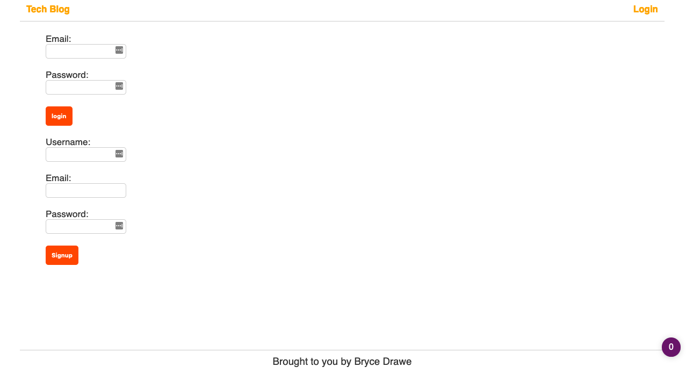
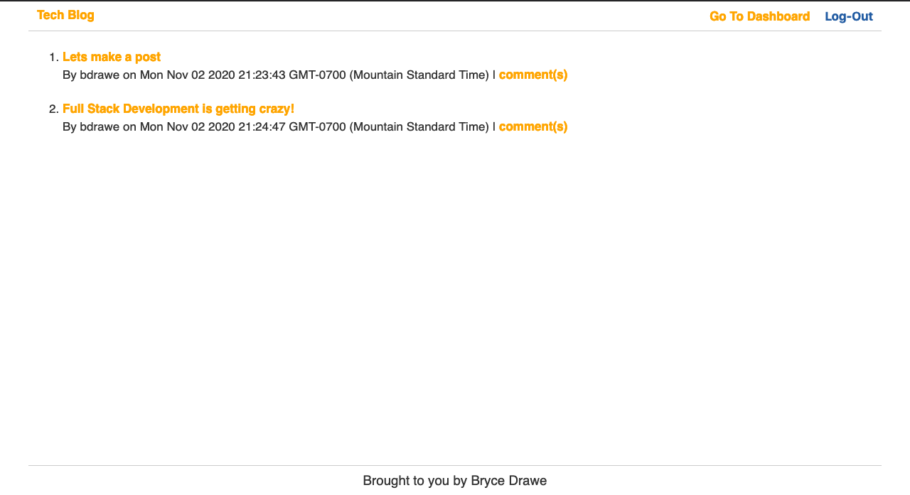

# Tech-Blog:

# Purpose
A place where people can write about tech and other things they are opinionated about

# Usage:
If you want make changes to this app, or use it, clone this repos, and run `npm install` in the main directory. Then, type `run npm start`. The app will run on http://localhost:3001.

# Functionality:
When you enter the app, you will be directed to the home page where their will be the hub of all of the posts that were written in the past. If you haven't signed up, you can sign up to post your own posts. After logging in, you will be directed to your dashboard and you can post and also view your posts and comments. Also in your user dashboard you can edit and delete your post.

If you wish to log out, simply click the loggout button and it will destroy your user session. 

# Images:
 
User's dashboard:

Signup/Login page:

Homepage:

# Running App
https://stormy-shore-56214.herokuapp.com/l
